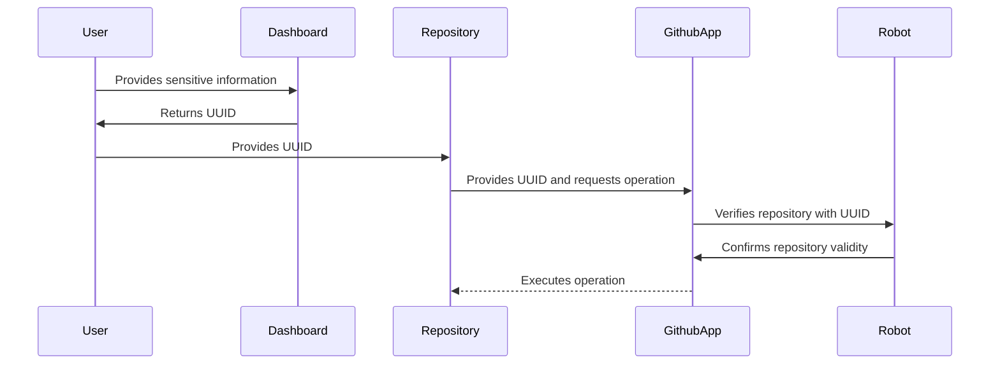

-----------------

# Contributor GitHub App

[中文README](README_CN.md)

✨ Welcome to the Contributor GitHub App! ✨

In a nutshell, to better manage projects, we need an enhanced Issue management tool. This is why I created this project.

🤖 By configuring bots with repository files, everyone can freely customize the bot. The bot will automatically handle
repository events based on the configuration file.

🐇 This project was inspired by
the [https://github.com/coderabbitai/ai-pr-reviewer/](https://github.com/coderabbitai/ai-pr-reviewer/) project. However,
it's unfortunate that they have decided to close their repository and code. Using it requires additional payment, and
although payment is necessary, I don't like closed systems and monthly billing. I prefer open, pay-as-you-go (or
self-hosted) services.

🚀 This repository includes a configuration file template, which you can use to set up your bot. Sensitive information
such as keys can be configured through my panel.

[**Install to your Repo**](https://github.com/apps/neutron-nerve)

[**Access the Dashboard**](https://contributor.dianas.cyou)

[**Get AI Service all-in-one**](https://www.ohmygpt.com/)

## Features

| Feature                         | Description                                                             | Configuration Section     |
|---------------------------------|-------------------------------------------------------------------------|---------------------------|
| 🌐 **Dashboard**                | Intuitive web panel for managing sensitive data and key configurations. | -                         |
| 📂 **Auto Labeling**            | Automatically label issues based on the configuration file.             | `issue_auto_label`        |
| 🗂 ~~**Issue Summary**~~        | Generate a summary of issues based on the configuration file.           | -                         |
| 📝 ~~**Issue Closed Report**~~  | Generate a report when an issue is closed.                              | `issue_close_with_report` |
| 📦 ~~**Release Note**~~         | Generate release notes based on the configuration file.                 | -                         |
| 📚 ~~**Documentation**~~        | Automatically translate documentation.                                  | -                         |
| 📌 ~~**Issue Title Standard**~~ | Standardize issue titles.                                               | `issue_auto_tidy`         |

## How to Use

1. **Install the App**: Install the app to your repository.
2. **Get Repo Token**: Add apikeys and other sensitive information to
   the [Dashboard](https://contributor.dianas.cyou).
3. **Build the `.nerve.toml` File**: Create a configuration file based on the template. [Example](.nerve.toml)

> **Note**: The panel is only used to store API-related keys. You fill in the UUID to your repository, and GithubApp
> collaborates with the repository to finally obtain the customized configuration.



## Custom Operations

Although the project may seem complex, adding new operations is actually quite simple. GitHub passes events through
webhooks, and we only need to handle these events and then execute our operations.

Please open the [main.py](main.py) file and add your custom operations.

Here is an example of a new listener:

```python
webhook_handler = ...
git_integration = ...
get_repo_setting = ...
logger = ...
from webhook.event.issue_comment import CreateIssueCommentEvent
from webhook.event_type import IssueComment


@webhook_handler.listen(IssueComment, action=IssueComment.CREATED, unique_id="uuid")
async def handle_issue_comment(event: CreateIssueCommentEvent):
    logger.info("Received IssueComment.CREATED event")
    repo_setting = get_repo_setting(
        repo_name=event.repository.full_name,
        repo=event.repository.get_repo(git_integration)
    )
    # repo_setting is the content of the .nerve.toml file
    issue = event.repository.get_issue(integration=git_integration, issue_number=event.issue.number)
    comment = issue.create_comment(f"Hello World!")
    issue.get_comment(comment.id).edit("Hello World! Edited")
    print(f"Issue: {event.issue.title}")
    print(f"Comment: {event.comment.body}")
    print(f"Repo: {event.repository.full_name}")
```

The same event can have multiple listeners, as long as each listener has a different `unique_id`.

## Deploy App

To deploy the app locally, follow these easy steps:

````shell
pdm install
npm install
nano .env
pm2 start pm2.json
````

## Acknowledgements

Special thanks to these resources that made this project possible:

- [chmouel/gosmee](https://github.com/chmouel/gosmee)
- [octokit/webhooks](https://github.com/octokit/webhooks/blob/main/payload-examples/api.github.com/issues/assigned.payload.json)
- [GitHub Webhooks Documentation](https://docs.github.com/en/webhooks/webhook-events-and-payloads#issues)
- [GitHub Webhooks Validation](https://docs.github.com/zh/webhooks/using-webhooks/validating-webhook-deliveries)
- [PyGithub Examples](https://github.com/PyGithub/PyGithub/blob/main/doc/examples/Issue.rst)

## License

This project have no license.

## Contributing

We welcome contributions! Please check out our [contributing guidelines](CONTRIBUTOR_LICENSE_AGREEMENT) for more
information.

## ⭐️ Star us

If you find this project helpful, don't forget to give us a star! ⭐️

Happy Coding! 💻