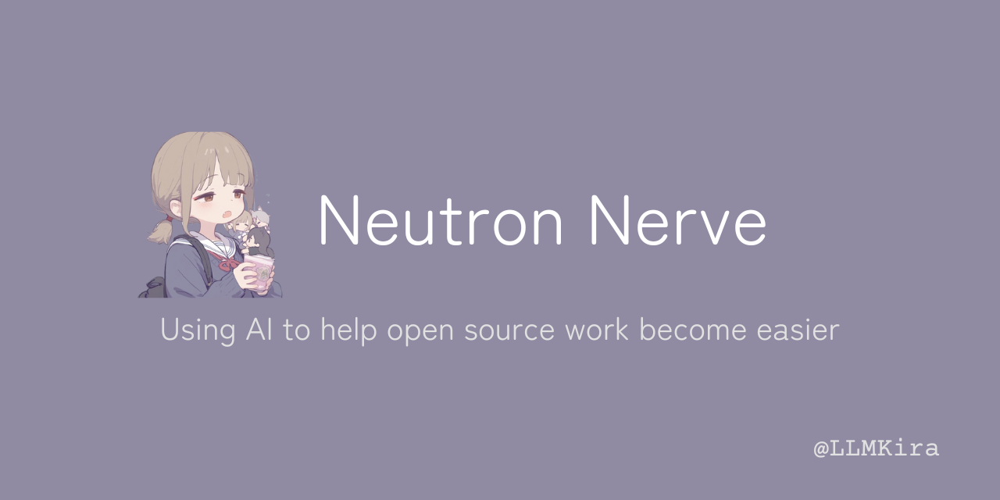

-----------------

# Contributor GitHub App

✨ Welcome to the Contributor GitHub App! ✨

In a nutshell, to better manage projects, we need an enhanced Issue management tool. This is why I created this project.

🤖 By configuring bots with repository files, everyone can freely customize the bot. The bot will automatically handle
repository events based on the configuration file.

🚀 This repository includes a configuration file template, which you can use to set up your bot. Sensitive information
such as keys can be configured through my panel.

[**Install to your Repo**](https://github.com/apps/neutron-nerve)

[**Access the Dashboard**](https://contributor.dianas.cyou)

[**Get AI Service all-in-one**](https://www.ohmygpt.com/)

## Features

| Feature                         | Description                                                             | Configuration Section     |
|---------------------------------|-------------------------------------------------------------------------|---------------------------|
| 🌐 **Dashboard**                | Intuitive web panel for managing sensitive data and key configurations. | -                         |
| 📂 **Auto Labeling**            | Automatically label issues based on the configuration file.             | `issue_auto_label`        |
| 🗂 ~~**Issue Summary**~~        | Generate a summary of issues based on the configuration file.           | -                         |
| 📝 ~~**Issue Closed Report**~~  | Generate a report when an issue is closed.                              | `issue_close_with_report` |
| 📦 ~~**Release Note**~~         | Generate release notes based on the configuration file.                 | -                         |
| 📚 ~~**Documentation**~~        | Automatically translate documentation.                                  | -                         |
| 📌 ~~**Issue Title Standard**~~ | Standardize issue titles.                                               | `issue_auto_tidy`         |

## Deploy App

To deploy the app locally, follow these easy steps:

````shell
pdm install
npm install
nano .env
pm2 start pm2.json
````

## Configuration

### 🛠 Configuration File

1. **Purpose**: Configure various aspects of the bot's behavior.
2. **Location**: This repository contains a template configuration file.
3. **Customization**: Adjust the template to fit your needs.

### 🔐 Sensitive Information

- Sensitive details such as keys should be configured through our secure panel.

## Features

- 📂 **Easy Repository Management**: Automated handling of repository events.
- ⚙️ **Fully Configurable**: Tailor the bot to your exact requirements.
- 🗂 **Template Provided**: Kickstart your setup with the provided configuration file template.
- 🌐 **Dashboard Interface**: Intuitive web panel for managing sensitive data and key configurations.

## Acknowledgements

Special thanks to these resources that made this project possible:

- [chmouel/gosmee](https://github.com/chmouel/gosmee)
- [octokit/webhooks](https://github.com/octokit/webhooks/blob/main/payload-examples/api.github.com/issues/assigned.payload.json)
- [GitHub Webhooks Documentation](https://docs.github.com/en/webhooks/webhook-events-and-payloads#issues)
- [GitHub Webhooks Validation](https://docs.github.com/zh/webhooks/using-webhooks/validating-webhook-deliveries)
- [PyGithub Examples](https://github.com/PyGithub/PyGithub/blob/main/doc/examples/Issue.rst)

## License

This project have no license.

## Contributing

We welcome contributions! Please check out our [contributing guidelines](CONTRIBUTOR_LICENSE_AGREEMENT) for more
information.

## ⭐️ Star us

If you find this project helpful, don't forget to give us a star! ⭐️

Happy Coding! 💻