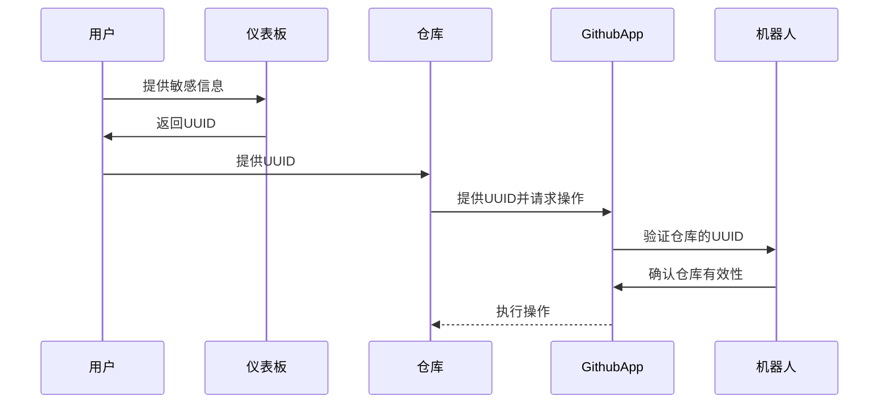

-----------------

# Contributor GitHub App

[English README](README.md)

✨欢迎使用Contributor GitHub App！✨

简而言之，为了更好地管理项目，我们需要一个增强的Issue管理工具。这就是我创建这个项目的原因。

🤖 通过配置仓库文件中的机器人，大家可以自由定制机器人的行为。机器人将根据配置文件自动处理仓库事件。

🐇 这个项目的灵感来自[https://github.com/coderabbitai/ai-pr-reviewer/](https://github.com/coderabbitai/ai-pr-reviewer/)
。然而，很遗憾他们决定关闭他们的存储库和代码。使用它需要额外的费用，虽然付费是必要的，但我不喜欢封闭的系统和按月计费。我更喜欢开放的、按需付费的（或自托管）的服务。

🚀 本仓库包括一个配置文件模板，您可以用它来设置您的机器人。密钥等敏感信息可以通过我的面板配置。

[**安装到你的仓库**](https://github.com/apps/neutron-nerve)

[**访问仪表板**](https://contributor.dianas.cyou)

[**AI服务聚合站**](https://www.ohmygpt.com/)

## 功能

| 功能                 | 描述                    | 相关配置                      |
|--------------------|-----------------------|---------------------------|
| 🌐 **仪表板**         | 用于管理敏感数据和密钥配置的直观网页面板。 | -                         |
| 📂 **自动标签**        | 根据配置文件自动给问题打标签。       | `issue_auto_label`        |
| 🗂 ~~**问题总结**~~    | 根据配置文件生成问题的总结。        | -                         |
| 📝 ~~**问题关闭报告**~~  | 当问题关闭时生成报告。           | `issue_close_with_report` |
| 📦 ~~**发布说明**~~    | 根据配置文件生成发布说明。         | -                         |
| 📚 ~~**文档翻译**~~    | 自动翻译文档。               | -                         |
| 📌 ~~**问题标题标准化**~~ | 标准化问题标题。              | `issue_auto_tidy`         |

## 如何使用

1. **安装应用**：将应用安装到您的仓库。
2. **获取仓库Token**：将API密钥和其他敏感信息添加到[仪表板](https://contributor.dianas.cyou)。
3. **构建 `.nerve.toml` 文件**：根据模板创建配置文件。[示例](.nerve.toml)

> **注意**：此面板仅用于存储与API相关的密钥。您将UUID填写到您的仓库中，GithubApp与仓库合作最终获取自定义配置。



## 定制操作

看起来项目很复杂，其实很简单就能添加一些新操作，Github 通过 Webhook 传递的事件，我们只需要处理这些事件，然后执行我们的操作。

请你打开 [main.py](main.py) 文件，然后添加你的操作。

一份新的监听例子：

```python
webhook_handler = ...
git_integration = ...
get_repo_setting = ...
logger = ...
from webhook.event.issue_comment import CreateIssueCommentEvent
from webhook.event_type import IssueComment


@webhook_handler.listen(IssueComment, action=IssueComment.CREATED, unique_id="uuid")
async def handle_issue_comment(event: CreateIssueCommentEvent):
    logger.info("Received IssueComment.CREATED event")
    repo_setting = get_repo_setting(
        repo_name=event.repository.full_name,
        repo=event.repository.get_repo(git_integration)
    )
    # repo_setting 就是 .nerve.toml 文件的内容模型
    issue = event.repository.get_issue(integration=git_integration, issue_number=event.issue.number)
    comment = issue.create_comment(f"Hello World!")
    issue.get_comment(comment.id).edit("Hello World! Edited")
    print(f"Issue: {event.issue.title}")
    print(f"Comment: {event.comment.body}")
    print(f"Repo: {event.repository.full_name}")
```

同样的事件可以有多个监听器，只要你的监听器有不同的 `unique_id`。

## 部署应用

按以下简单步骤在本地部署应用：

```shell
pdm install
npm install
cp .env.example .env
nano .env
pm2 start pm2.json
```

## 致谢

特别感谢以下资源使这个项目成为可能：

- [chmouel/gosmee](https://github.com/chmouel/gosmee)
- [octokit/webhooks](https://github.com/octokit/webhooks/blob/main/payload-examples/api.github.com/issues/assigned.payload.json)
- [GitHub Webhooks Documentation](https://docs.github.com/en/webhooks/webhook-events-and-payloads#issues)
- [GitHub Webhooks Validation](https://docs.github.com/zh/webhooks/using-webhooks/validating-webhook-deliveries)
- [PyGithub Examples](https://github.com/PyGithub/PyGithub/blob/main/doc/examples/Issue.rst)

## 许可证

这个项目没有许可证。

## 贡献

我们欢迎贡献！请查看我们的[贡献指南](CONTRIBUTOR_LICENSE_AGREEMENT.md)了解更多信息。

## ⭐️ 给我们加星

如果您觉得这个项目有帮助，不要忘记给我们加星！⭐️
